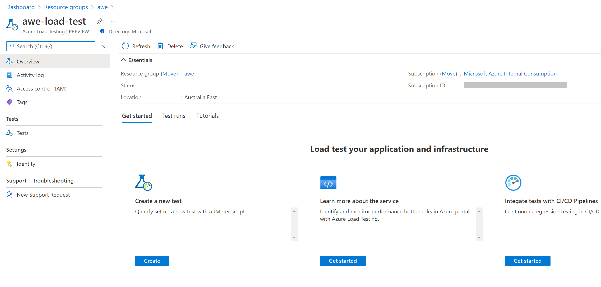
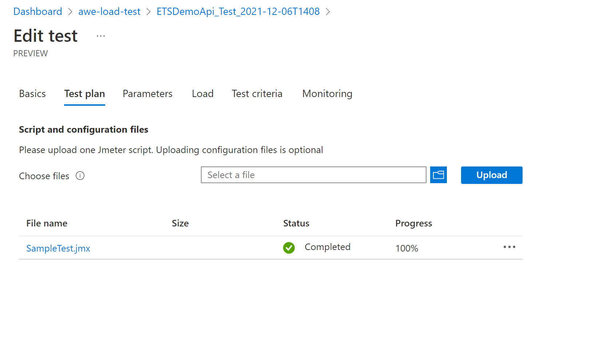
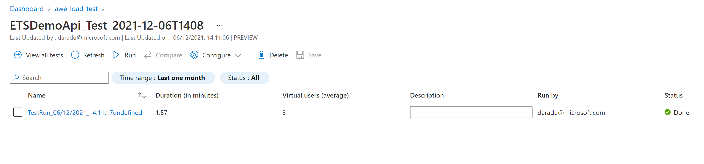
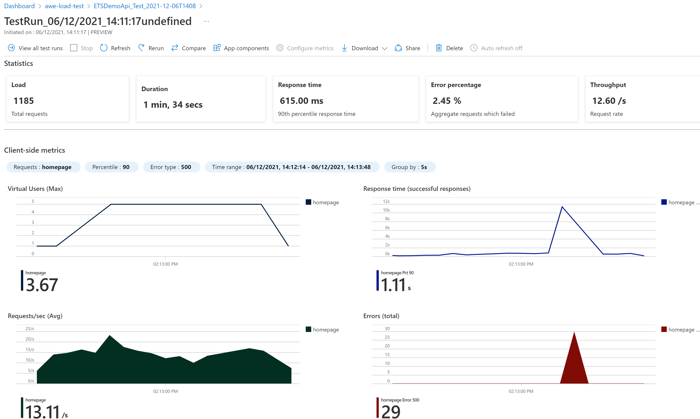
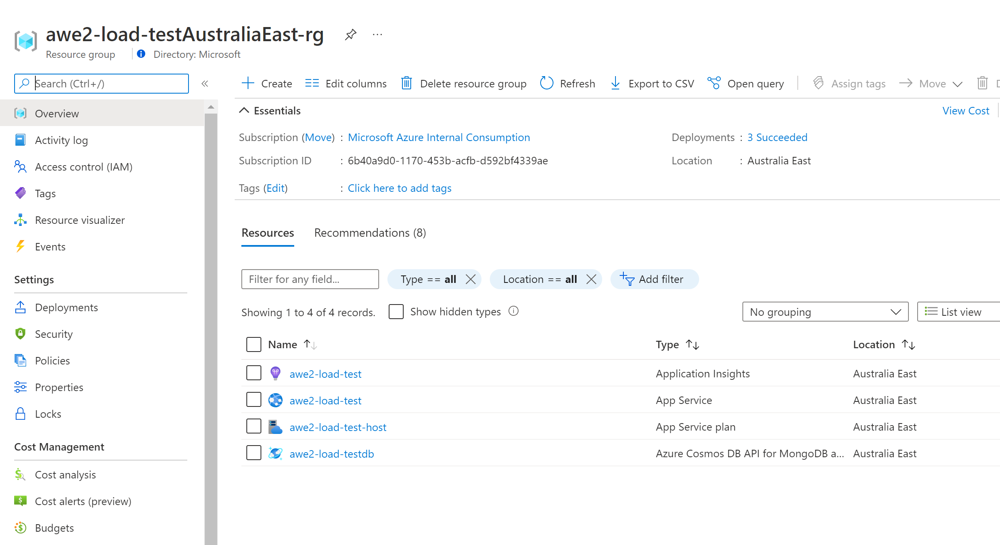
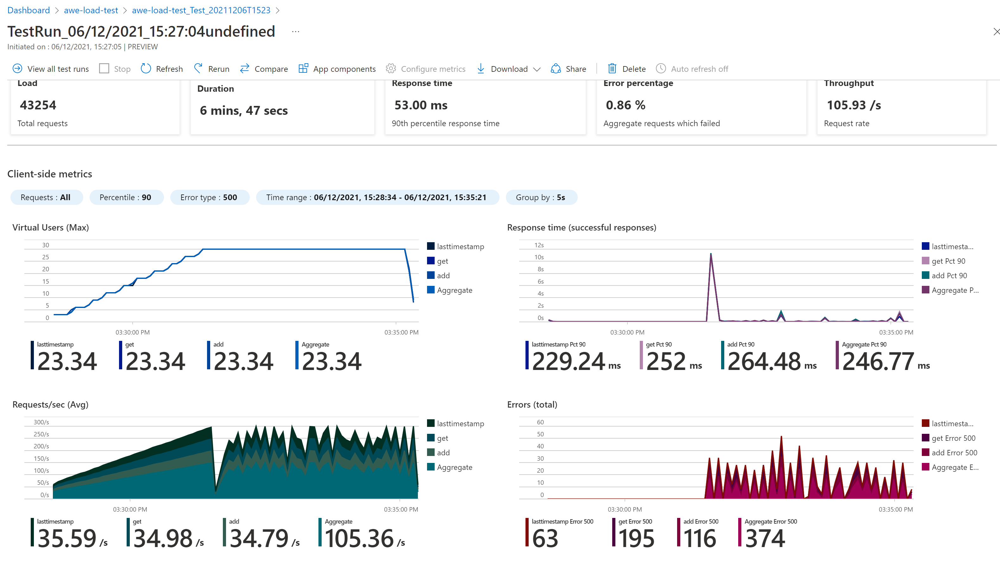
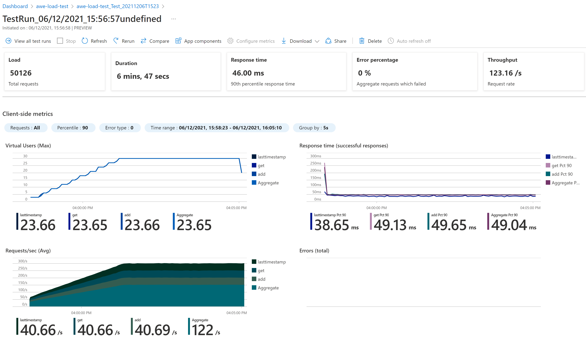
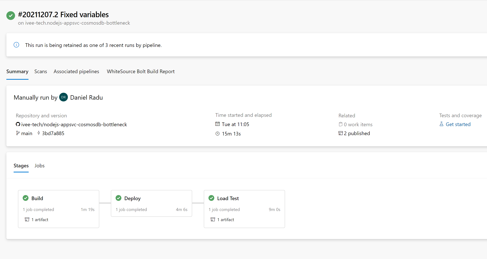

# Introduction 
The following guide helps you get started with Azure Load Testing.

Azure Load Testing allows the generation of high-scale load to test the performance of your applications.

It is based on Apache JMeter, a popular performance and load testing tool. 
You can write your own JMeter script, upload it to your Azure Load Testing instance and execute as many tests as required.

The guide is based on Microsoft documentation pages:
- What is Azure Load Testing
https://docs.microsoft.com/en-au/azure/load-testing/overview-what-is-azure-load-testing
- Create & run a load test
https://docs.microsoft.com/en-au/azure/load-testing/quickstart-create-and-run-load-test
- Identify performance bottlenecks
https://docs.microsoft.com/en-au/azure/load-testing/tutorial-identify-bottlenecks-azure-portal
- Automate with Azure Pipelines
https://docs.microsoft.com/en-au/azure/load-testing/tutorial-cicd-azure-pipelines

# Getting Started

First, you will need to create an Azure Load Testing instance, as described in the documentation:
https://docs.microsoft.com/en-au/azure/load-testing/quickstart-create-and-run-load-test

A load testing instance looks similar to the one below:



The **Tests** section shows the list of existing tests where you can create or edit a load test.

In order to create / edit tests, user must have one of the following built-in roles:
- **Load Test Contributor**
- **Load Test Owner**

When creating / editing the test, the Test Plan section allows uploading your JMeter script:



An JMeter script example is available in the *./SampleTest.jmx* file.

Some settings require modifications: **HTTPSampler.domain**, **HTTPSampler.path**, **HTTPSampler.method**, etc.

``` xml
        <HTTPSamplerProxy guiclass="HttpTestSampleGui" testclass="HTTPSamplerProxy" testname="homepage" enabled="true">
          <elementProp name="HTTPsampler.Arguments" elementType="Arguments" guiclass="HTTPArgumentsPanel" testclass="Arguments" testname="User Defined Variables" enabled="true">
            <collectionProp name="Arguments.arguments"/>
          </elementProp>
          <stringProp name="HTTPSampler.domain">ets-demo-api-test.azurewebsites.net</stringProp>
          <stringProp name="HTTPSampler.port"></stringProp>
          <stringProp name="HTTPSampler.protocol">https</stringProp>
          <stringProp name="HTTPSampler.contentEncoding"></stringProp>
          <stringProp name="HTTPSampler.path">/api/calculator/result?expression=1%2B2*%283-4/5%29</stringProp>
          <stringProp name="HTTPSampler.method">GET</stringProp>
          <boolProp name="HTTPSampler.follow_redirects">true</boolProp>
          <boolProp name="HTTPSampler.auto_redirects">false</boolProp>
          <boolProp name="HTTPSampler.use_keepalive">true</boolProp>
          <boolProp name="HTTPSampler.DO_MULTIPART_POST">false</boolProp>
          <stringProp name="HTTPSampler.embedded_url_re"></stringProp>
          <stringProp name="HTTPSampler.implementation">HttpClient4</stringProp>
          <stringProp name="HTTPSampler.connect_timeout">60000</stringProp>
          <stringProp name="HTTPSampler.response_timeout">60000</stringProp>
        </HTTPSamplerProxy>
```

Additional configuration is available - parameters, load (the number of parallel engine instances used to execute the tests), test criteria, monitoring.

When opening an existing Test, the list of test runs is available:



The test is calling the calculator demo API, running a simple expression and returning a JSON result:

https://ets-demo-api-test.azurewebsites.net/api/calculator/result?expression=1%2B2*%283-4/5%29

``` json
{"expression":"1+2*(3-4/5)","result":5.4}
```

A test run example is displayed below:



# Identify performance bottlenecks
If the system under test is running in Azure, you can add application components and evaluate their behaviour during load testing.

The documentation example uses a NodeJS web app on a P2v3 plan consuming a CosmosDB Mongo API database.
There is also an App Insights instance which can be used with the load test to monitor application performance.
The CosmosDB initial scale is 400 RU.

https://docs.microsoft.com/en-au/azure/load-testing/tutorial-identify-bottlenecks-azure-portal

The application code can be found here:

https://github.com/Azure-Samples/nodejs-appsvc-cosmosdb-bottleneck



The initial test run (using the default 400 RU) shows the **add** and **get** DB calls getting many 500 errors, due to the high-load that the application is unable to handle:



Once the DB scale has been increased to 1200 RU, the performance is much better with essentially no 500 error:




# Automate with Azure Pipelines

The Azure Load Testing tests execution can be integrated in Azure Pipelines using the free marketplace extension:

https://marketplace.visualstudio.com/items?itemName=AzloadTest.AzloadTesting&ssr=false#overview

The example targets the same application used in the previous section:
https://github.com/Azure-Samples/nodejs-appsvc-cosmosdb-bottleneck

The *azure-pipelines.yml* file contains multi-stage pipeline required to build and deploy the application, as well as load tests execution using the Azure Load Testing instance. The test results are published as artifacts.

This is the load test stage:

``` yaml
- stage: LoadTest
  displayName: Load Test
  dependsOn: Deploy
  condition: succeeded()
  jobs:
  - job: LoadTest
    displayName: Load Test
    pool:
      vmImage: ubuntu-latest
    steps:
    - task: AzureLoadTest@1
      inputs:
        azureSubscription: $(serviceConnection)
        loadTestConfigFile: 'SampleApp.yaml'
        resourceGroup: $(loadTestResourceGroup)
        loadTestResource: $(loadTestResource)
```

And the pipeline run:


